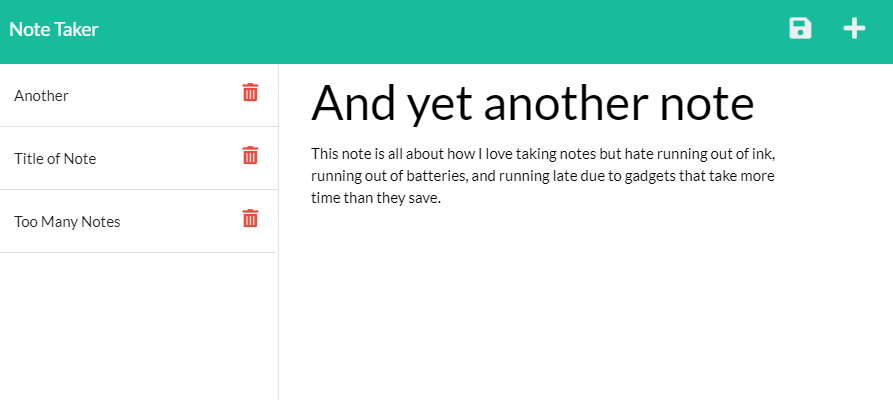
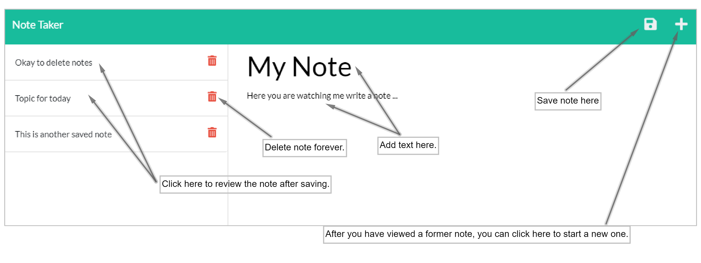

# Heroku XPress Notetaker
### *Tracking all you need to know on the go!*

I am sick of wasting time fiddling with my iPhone's *notes* when the interface freezes. I am tired of being a slave to 
technology which should be serving me! If you are like me, you might find it kind of nice when an app is really 
simple, easy to use and dependable. This one is as simple as it gets without going to the command line, or a pocket paper pad.
___
 
 
 

___

You might want to check this idea out. [Heroku XPress Notetaker.](https://heroku-xpress-notes.herokuapp.com/.) This might be a solution
for you if you, like me, are tired of overloaded apps. The cloud is the way to go. This app is light, fast and extremely easy to use.
Just enter your notes, press save, and you are ready to. Accessing your notes later is just a click. It really is the digital 
equivalent of a pocket notepad. But you can save your notes in the cloud and access them from anywhere. No paper trail.

*Why XPress* --- no, not what you might think. *X* as in 'without'. This app was not developed with a huge marketing idea
in mind, it never went to 'press' and probably never will. It is free, free to use, free to distribute. 

*Why Heroku* --- Simple. They allow for this stand-alone app  fully and *freely* deployed on [Heroku](heroku.com). 

___
### User Experience

After starting the app, you will get a chance to add your own notes like the one shown below. You can enter and save as many notes
as you like. Just be careful of what you enter. As of this day (22, July 2021), we have no password protection on the app. 
So the only protection to the publicly viewable site is the newly (today 23, July 2021) added delete feature.  

___

___

## Installation and Usage

There is nothing to install if you want to check out a demo of this app. Simply visit [here](https://heroku-xpress-notes.herokuapp.com/notes) and click enter.
It is very easy to use. The following diagram illustrates the basic features.

___

___

### Requirements for Local Installation
If you like this app and would like a working copy on your local machine, you will need to do the following;
* Make sure you have command line access, as in Git Bash, or equivalent, with Node.js installed. 
* Download this repository into your home directory and navigate to the folder where it was saved. 
* Initialize the application from the command line with the command 'npm install' --- this will load the package repositories required by the app.
* Start the app on your local machine with 'npm run serve'. 
* Open a browser and you should be able to view the app on 'localhost: 3001'.

## Development, Performance, and Forward Issues
1. The server side of this application was developed in Node.js version 16.3 with Express.js. Locally, this deployment works fine, but testing on live deployment with the Heroku servers revealed that there are server-side data-base perseverence issues. If one does not include the 'delete' feature for the notes, notes are presevered independent of server starts and stops. However, there are some problems with database integrity subject to server shutdown. This problem I have not been able to diagnose yet.
   
2. While a public 'notes' repository is a nice place to feature an application like this, it is not at all practical. Hence a password protection envelope should enclose this application for reasonable considerations.
   
3. A device like this, with suitable password protection, could be configured with the [team profiler](https://github.com/palexander227/team-profiler) to provide a very streamlined, no-frills, inter-team development chat framework. This is an interesting problems I am working on. 

## Acknowledgements

Again, many thanks to the instructors and staff with the U.C. Berkeley Coding Bootcamp who have truly inspired me to "get the lead out" and move forward with new ideas and frontiers that await those who truly love this industry!

## Ideas

Please feel free to contact me with ideas and issues. I would love to discuss issues of implementation and integration of my other resources (under construction).

  

