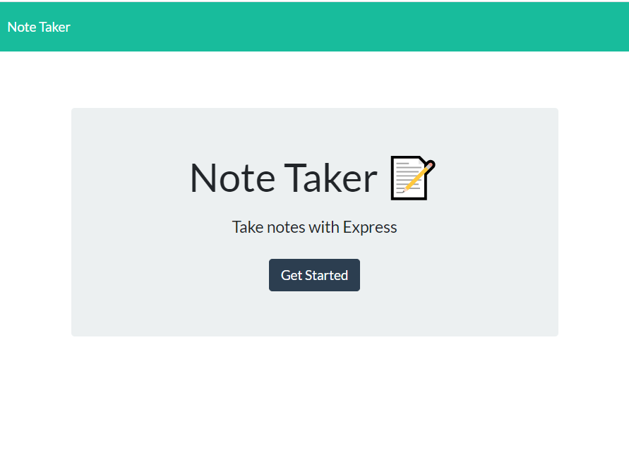

# Heroku XPress Notetaker
### *Tracking all you need to know on the go!*

I am sick of wasting time fiddling with my iPhone's *notes* when the interface freezes. I am tired of being a slave to 
technology which should be serving me! If you are like me, you might find it kind of nice when an app is really 
simple, easy to use and dependable. This one is as simple as it gets without going to the command line, or a pocket pad.
...
 
 
                    (width=200) 

You might want to check this idea out. [Heroku XPress Notetaker.](https://heroku-xpress-notes.herokuapp.com/.) This might be a solution
for you if you, like me, are tired of overloaded apps. The cloud is the way to go. This app is light, fast and extremely easy to use.
Just enter your notes, press save, and you are ready to. Accessing your notes later is just a click. It really is the digital 
equivalent of a pocket notepad. But you can save your notes in the cloud and access them from anywhere. No paper trail.

*Why XPress* --- no, not what you might think. *X* as in 'without'. This app was not developed with a huge marketing idea
in mind, it never went to 'press' and probably never will. It is free, free to use, free to distribute. 

*Why Heroku* --- It is a stand-alone app  fully and *freely* deployed on [Heroku](heroku.com). 

